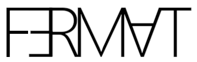

A simple Lean proof of Fermat's little theorem.

## Usage

The theorem takes a single hypothesis `Nat.Prime p`:

```lean
import Little.Basic

example (n : ℕ) : n^13 ≡ n [MOD 13] := by
  have : Nat.Prime 13 := by trivial
  exact mod_pow_Fermat this
```

## Q&A

> What is this?

This is a Lean 4 library. It provides a formal proof of Fermat's little theorem.

> Should I use this?

No, use [`Nat.ModEq.pow_totient`](https://leanprover-community.github.io/mathlib4_docs/Mathlib/FieldTheory/Finite/Basic.html#Nat.ModEq.pow_totient) instead.

> What is Lean?

A [free](https://github.com/leanprover/lean4) functional programming language and interactive theorem prover.

> What is Fermat's little theorem?

It is not the [famously difficult theorem](https://github.com/ImperialCollegeLondon/FLT) named after Fermat. The little theorem is easy to prove.

> What does the little theorem say?

If `p` is a prime number then it divides `nᵖ - n` for any positive integer `n`.

> And you proved it?

Well no, I just wrote this proof. Euler proved the theorem. Or maybe Leibniz? It does not matter.

> How does your proof work?

By induction using the binomial theorem.

> Why should I trust you with this?

You should not. This is my first time using Lean.

> But is the proof correct?

Lean says it is. You are welcome to read it and decide for yourself.

## License

The code is free software: you can redistribute it and/or modify it under the terms of the
[GNU General Public License](https://www.gnu.org/licenses/) as published by the Free Software Foundation,
either version 3 of the License, or (at your option) any later version.

The logo is free art: you can redistribute it and/or modify it under the terms of the
[CC BY-NC-SA 4.0 License](https://creativecommons.org/licenses/) as published by Creative Commons.

The theorem is republished courtesy of Pierre de Fermat.

You should have received a [copy](COPYING.md) of the GNU General Public License along with this project.

***

Copyright © 2024 Nicolas Canceill
